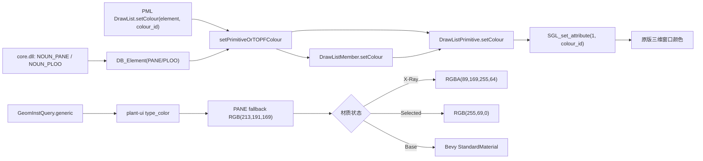

# `PANE` 配色链逆向报告

## 结论

截图中的土建 `PANE` **没有从 `core.dll` 自身读取一个固定 RGB 颜色**。`core.dll` 负责注册数据库名词/属性（`PANE`、`PLOO`、`PANESI`）；原版三维显示由 `Core3D.dll` 的 DrawList 以“视图内颜色编号”覆盖 TOPF/primitive，并最终写入 SGL 属性 1。当前 `plant-ui` 则绕开这套 DrawList 状态，直接按 `GeomInstQuery.generic` 选 Bevy `StandardMaterial`。

因此，同一块 `PANE` 在两边颜色不同是两套规则导致的：

- 原版窗口中的亮黄：当前 DrawList/表示规则赋给该 TOPF 或 primitive 的颜色编号；不是 `PANE` 名词的编译期常量。
- `plant-ui` 常态：`PANE` 没有专门分支，落到米色 `RGB(213,191,169)`。
- `plant-ui` 截图中的淡蓝：若该模型处于房间 X-Ray 集合，则由 `RGBA(89,169,255,64)` 覆盖；X-Ray 优先级高于选中。
- 普通选中：当前代码使用橙红 `RGB(255,69,0)`，不是截图中的淡蓝。

## `core.dll` 证据

| 对象 | 地址/函数 | 观察结果 |
|---|---:|---|
| `NOUN_PANE` 存储槽 | `0x6422C84` | `sub_57ECA70` 分配 `0x130` 字节并调用 `DB_Noun("PANE", true)`，随后写入该全局槽。|
| `ATT_PANESI` 存储槽 | `0x6421260` | `sub_5730310` 分配 `0x114` 字节并调用 `DB_Attribute("PANESI", true)`。|
| `NOUN_PLOO` | 导出名表 | 存在 `?NOUN_PLOO@@3QBVDB_Noun@@B`；用于边界子元素的数据库类型描述。|
| `Core3D.dll` 导入 | `0x10AE9FF0` | 从 `core` 导入 `NOUN_PANE`。|
| `Core3D.dll` 导入 | `0x10AE76B4` | 从 `core` 导入 `NOUN_PLOO`。|
| `Core3D.dll` 导入 | — | 未发现 `ATT_PANESI` 被 Core3D 显示链直接导入，说明尺寸属性不是颜色输入。|

这部分说明 `core.dll` 提供的是**类型身份与模式元数据**，而非 `PANE -> RGB` 映射。

## 原版 `Core3D.dll` 配色链

关键函数：

1. `PML_DrawList::setColour`（`sub_1053DDE0`）
   - 从 PML 对象读取 `REF1`、`REF2`、`TYPE`；
   - 把颜色实数转为整数颜色编号；
   - 调 `DES_DrawList::setPrimitiveOrTOPFColour(element, colour_id)`。
2. `DES_DrawList::setPrimitiveOrTOPFColour`（`0x1051E850`）
   - 已存在 TOPF member：直接 `DES_DrawListMember::setColour`；
   - primitive 或叶节点：找到祖先 TOPF，必要时为 primitive 建显示项；
   - 容器元素：遍历成员/TOPF，把同一颜色编号向下应用。
3. `DES_DrawListMember::setColour`（`0x1055CBE0`）
   - 把颜色编号写入 member 的 `+0x08` 字段；
   - 遍历其 primitives 继续调用 `DES_DrawListPrimitive::setColour`。
4. `DES_DrawListPrimitive::setColour`（`0x1055CD10`）
   - 定位对应 SGL 引用；
   - 执行 `SGL_set_attribute(1, colour_id)`；
   - 调 `DES_DrawList::sglUpdate(0)` 刷新显示。
5. `DES_DrawList::getPrimitiveOrTOPFColour`（`0x10518440`）
   - 读取 primitive 自身颜色；没有 primitive 覆盖时回退到 TOPF member。

`DES_DrawList::updateAutoColour`（`0x10521AE0`）还会读取颜色表索引 `293` 的实际 RGB；自动颜色或该 RGB 变化会触发 `DES_DrawListRefresh::change/update`。这进一步证明运行时颜色来自 DrawList/颜色表状态。

## 当前 `plant-ui` 行为

文件：`crates/plant-ui-view3d/src/lib.rs`

- `type_color`（1156–1170）：`PANE` 未单列，走 `_ => RGB(213,191,169)`。
- `model_material`（1175–1188）：金属度 `0.1`、粗糙度 `0.7`、双面、关闭背面剔除。
- `material_state`（1284–1297）：优先级为 `X-Ray > Selected > Base`，并同时匹配模型 `refno` 与 `owner`。
- `apply_selection`（2028–2057）：用 `base/highlight/xray` 三个材质句柄切换。
- 常量：`SELECT_COLOR = RGB(255,69,0)`；`XRAY_COLOR = RGBA(89,169,255,64)`。

## 对截图的判定

左侧浅蓝且透明感明显，更符合 `XRAY_COLOR`，不符合 `PANE` 常态米色，也不符合当前橙红选中色。树行虽然选中了 `PANE 1`，但材质裁决中 X-Ray 先于 Selected，所以一个同时属于 X-Ray 集合且被选中的对象仍显示淡蓝。

右侧原版黄色来自 DrawList/表示规则中的颜色编号。要做到逐像素一致，需要把原版视图的 `colour_id -> RGB` 颜色表以及每个元素当前 primitive/TOPF 覆盖一起传给 `plant-ui`；只依据 `core.dll` 的 noun 或 `PANESI` 推不出该黄色。

## 实施建议

若目标只是让土建 `PANE` 固定接近原版黄色，可在 `type_color` 增加 `PdmsGenericType::PANE` 分支。若目标是完整复刻原版，应在模型接口中增加可选 `colour_id/RGB`，并采用：

1. primitive 显式色；
2. TOPF/member 继承色；
3. generic 类型兜底色；
4. X-Ray/Selection 临时覆盖。

这种顺序与已还原的 DrawList 读取/写入语义一致，也不会把数据库尺寸属性误当作材质属性。
