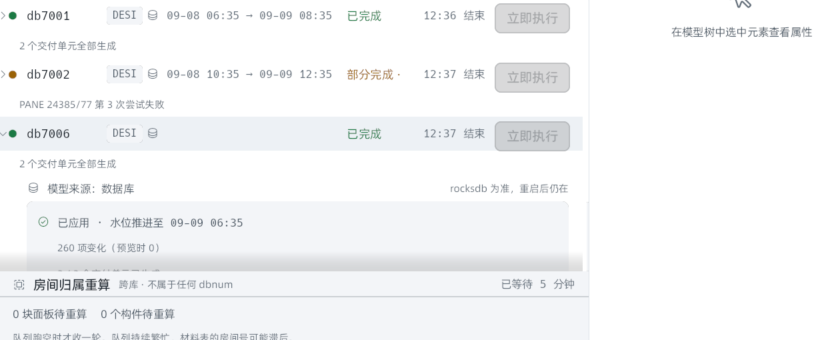
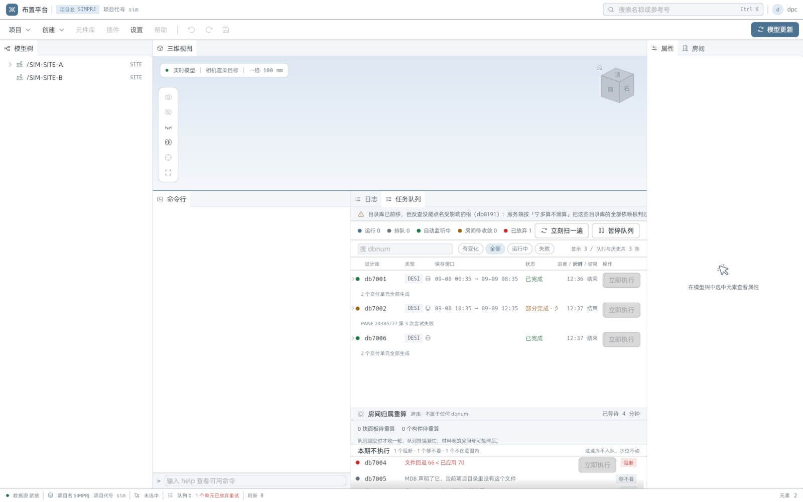

# 终态行内明细 sim 目检 · 三数 / 分布条 / 刚体前移句

> 计划 `docs/plans/2026-09-09-task-finished-detail-plan.md` V1 / V2 的界面目检记录。
> 用内置剧本（`PLANT_UI_SIM=1`）跑，不是 §六「验收（实机）」——那四条要真 gen-model
> 在场，仍然欠着；这一份验的是渲染路径在真窗口里的样子，与单测互补。

- 生成：2026-09-09 12:36–12:41（UTC+8）
- 跑法：`plant-ui-app.exe`（debug，2026-09-09 10:53 构建，其后工作树无 `.rs` 改动）带
  `PLANT_UI_SIM=1` + `EGUI_INSPECTION=127.0.0.1:5721` 启动；用同仓 `inspect` 探针
  （tree / click / drag / shot）驱动：「模型更新」→ 预览 →「开始更新 · 3 个批次」→
  「确认并开始」，队列跑完（db7001 / db7002 / db7006 + 房间轮）后展开终态行截图。
- 截图坐标一律逻辑点（`shot` 按 ppp = 1.0 出图，与 `tree` 包围盒同一套）。

## db7001（V1 三数 + V2 刚体前移，全部对上）

| 验的 | 期望（QUEUE-FIELD-MAP §1.5 / 计划 §2） | 看到的 | 判 |
|---|---|---|---|
| 增删改三数 | `+a ~m −d`，success / warn / danger 与预览页 S2 同款 | `+3 新增`（绿）`~3 修改`（黄）`−1 删除`（红） | ✓ |
| 总数句（三数在场形态） | 带「共」、`·` 接预览值 | `· 共 7 项变化 · 预览时 7`，且 3+3+1 = 7 | ✓ |
| 分布条 | 三段与三数同比例，复用 `ratio_bar` | 绿 / 黄 / 红 ≈ 3 : 3 : 1 | ✓ |
| 刚体前移句 | 计数 > 0 才画，措辞按 V2 | `刚体前移 1 根（只动方位，网格未重算）`——剧本里 7001 恰一根 EQUI 标 `transform` | ✓ |
| 模型段计数 | `units_done / total` | `2 / 2 个交付单元已生成`，随后 `模型树已就地刷新` | ✓ |
| 保存窗口 | 两端 E3D 写入时刻（ADR-0019 / ADR-020） | `09-08 06:35 → 09-09 08:35 · 已应用 · 水位推进至 09-09 08:35` | ✓ |

## db7006（分解缺席降级句，V1 的另一半）

首次导入库（分解字段全零、`changed_elements = 260`）落进「分解缺席」分支：只画
**`260 项变化（预览时 0）`**——不带「共」、预览值进括号，正是 §1.5 那一字之差的降级
记号；画面上没有 0 / 0 / 0、没有分布条。「预览时 0」是剧本形状（首次导入的预览给不出
计数、缓存成 0），界面照实画；要不要「预览计数缺席就不带括号」是文案裁量，不是缺陷。

## 队列全景（三任务终态 + 死信剧本如常）

db7001 已完成 / db7002 部分完成（PANE 24385/77 第 3 次尝试失败 → 已放弃 1，剧本注入）/
db7006 已完成；房间归属重算泳道随后收敛。与 sim 剧本的既定形状一致。

## 复跑要点（一次踩完的坑）

- `inspect` 的 `tree` 包围盒、`click` 坐标、`shot`（ppp = 1.0）三者同一套**逻辑点**；
  从缩过的截图上估坐标要按原图 1600 宽换算回去。
- 自绘控件（`widgets::button`、队列行、dock 页签）不进 AccessKit 树——先 `shot` 再按图
  换算点位；dock 上下分隔条要按在那条 3px 带内才拖得动（`tree` 里是个 `984x3` 的
  Unknown 节点，按它中心拖）。
- 演示实例闪退过一次（无 panic 输出、事件日志无 WER 记录，未定因）；死后系统自动又拉起
  同名实例抢占默认探针口 5719，会探到别的窗口。用专用口（`EGUI_INSPECTION=127.0.0.1:5721`）
  并在起跑前 `Stop-Process -Name plant-ui-app` 清场；换口重跑后全程稳定未复现。
